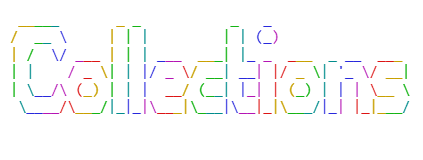

                                                 
<div>
<center>

   

# collections.dev
**Colección de recursos de desarrollo web.**

[collections.dev](https://collections-dev.vercel.app/)
</center>
</div>

## Descripción
Este proyecto es una colección de recursos de desarrollo web, incluyendo tutoriales, herramientas, bibliotecas y otros materiales útiles para desarrolladores. El objetivo es proporcionar un lugar centralizado donde los desarrolladores puedan encontrar recursos de alta calidad para mejorar sus habilidades y conocimientos en el desarrollo web.

## Características
- **Recursos Curados**: Todos los recursos incluidos en la colección han sido cuidadosamente seleccionados para garantizar su calidad y relevancia.
- **Categorías**: Los recursos están organizados en categorías para facilitar la navegación y búsqueda.
- **Actualizaciones Regulares**: La colección se actualiza regularmente con nuevos recursos para mantenerla relevante y útil.
- **Contribuciones Abiertas**: Los desarrolladores pueden contribuir con nuevos recursos a través de pull requests en el repositorio de GitHub.

## ¿Cómo instalarlo de forma local?
Si quieres instalarlo de forma local, ya que **no necesitas una base de datos** para que funcione, puedes clonar el repositorio y agregar tus propios archivos **.mdx**!

1. Clona el repositorio:
```bash
git clone https://github.com/xWickz/collections.dev.git
```

2. Navega al directorio del proyecto:
```bash
cd collections.dev
```

3. Instala las dependencias:
```bash
pnpm install
```

4. Inicia el servidor de desarrollo:
```bash
pnpm dev
```

## Agregar archivos 
Si deseas agregar archivos customizados, puedes crear archivos **.mdx** dentro de la carpeta `content`. Asegúrate de seguir la estructura y formato adecuados para que los recursos se muestren correctamente en la aplicación.